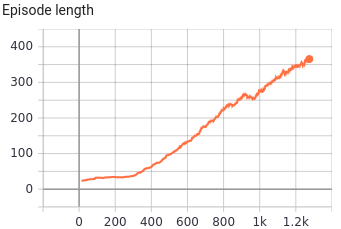

[](http://makeapullrequest.com)  

# A3C-ACER-PyTorch

This repository contains **PyTorch Implementation** of papers **Sample Efficient Actor-Critic with Experience Replay** (a.k.a **ACER**) and, **Asynchronous Methods for Deep Reinforcement Learning** (a.ka. **A3C**.)

The A3C paper introduced some key ideas that can be summarized into:
1. Asynchronous updates from multiple parallel agents to decorrelates the agent's data into a more stationary process rather than maintaining an Experience Replay Memory. Consequently, exceeding limits of off-policy methods and also, reducing memory computation per real interaction with the environment.
2. Architectures that share layers between the policy and value function. Thus, providing better and more efficient representation learning and feature extraction.
3. An updating scheme that operates on fixed-length segments of experiences (say, 5 or 20 time steps) that increase stationarity of the agent's data.

**But:**
A3C's lack of Experience Replay means it is considerably Sample-Inefficient and the number of interactions with the environment, needed to solve the task, is consequently **high**.

Based on this deficit of the A3C, ACER introduces an actor-critic method upon A3C's core structure  accompanied by benefits of having thread-based  Experience Replays to improve sample efficiency. 
More precisely, in the ACER algorithm, each of the parallel agents on the one hand, performs A3C-like on-policy updates and on the other, has its own Experience Replay buffer to perform off-policy updates.

Also, the ACER utilizes more advanced techniques like Truncated Importance Sampling with Bias Correction, Stochastic Dueling Network Architectures and, Efficient Trust Region Policy Optimization to further improve stability (which is a common challenge in Policy Gradient methods) and also helps increasing Sample Efficiency even more.

**This repository contains the discrete implementation of the ACER [here](https://github.com/alirezakazemipour/A3C-ACER-PyTorch) and the A3C's [here](https://github.com/alirezakazemipour/A3C-ACER-PyTorch/tree/A3C_Atari) **.

>However, continuous implementations are also provided [here](https://github.com/alirezakazemipour/A3C-ACER-PyTorch/tree/ACER_Continuous) for the ACER and [here](https://github.com/alirezakazemipour/A3C-ACER-PyTorch/tree/A3C) for A3C, they have not been tested yet and they will be added to the current work whenever they're suitably debugged and validated in the future.

## Results

> number of parallel agents = 8.  
> x-axis corresponds episode number.


ACER's Output| ACER's Output
:-----------------------:|:-----------------------:
| 
Running Episode Reward|Running Episode Reward
|  
Running Episode Length|Running Episode Length
|  

### Comparison

> number of parallel agents = 2  
>  x-axis corresponds episode number.


- The Sample Efficiency promised by the ACER is obvious as it can be seen on the left plot that the score of 21 has been achieved X episodes vs. Y episode of the Recurrent A3C on the right.

## Table of Hyperparameters

Parameter| Value
:-----------------------:|:-----------------------:|
lr			     | 1e-4
entropy coefficient | 64
gamma	          | 0.99
k (rollout length) | 20
total memory size (Aggregation of all parallel agents' replay buffers)| 6e+5
per agent replay memory size | 6e+5 / number of agents / rollout length
c (used in truncated importance sampling)| 10
&delta; (used in trust-region computation)| 1
replay ratio| 4
polyak average coefficients | 0.01 (1 - 0.99)
critic loss coefficient| 0.5
max grad norm| 40


## Dependencies

- PyYAML == 5.4.1
- cronyo == 0.4.5
- gym == 0.17.3
- numpy == 1.19.2
- opencv_contrib_python == 4.4.0.44
- psutil == 5.5.1
- torch == 1.6.0

## Installation

```bash
pip3 install -r requirements.txt
```

## Usage

### How to Run
```bash
usage: main.py [-h] [--env_name ENV_NAME] [--interval INTERVAL] [--do_train]
               [--train_from_scratch] [--seed SEED]

Variable parameters based on the configuration of the machine or user's choice

optional arguments:
  -h, --help            show this help message and exit
  --env_name ENV_NAME   Name of the environment.
  --interval INTERVAL   The interval specifies how often different parameters
                        should be saved and printed, counted by episodes.
  --do_train            The flag determines whether to train the agent or play with it.
  --train_from_scratch  The flag determines whether to train from scratch or continue previous tries.
  --seed SEED           The randomness' seed for torch, numpy, random & gym[env].
```
- **In order to train the agent with default arguments , execute the following command and use `--do_train` flag, otherwise the agent would be tested** (You may change the environment and random seed based on your desire.):
```shell
python3 main.py --do_train --env_name="PongNoFrameskip-v4" --interval=200
```
- **If you want to keep training your previous run, execute the following (add `--train_from_scratch` flag):**
```shell
python3 main.py --do_train --env_name="PongNoFrameskip-v4" --interval=200 --train_from_scratch
```
### Hardware Requirements
- All runs with 8 parallel agents were carried out on [paperspace.com](https://www.paperspace.com/) [Free-GPU, 8 Cores, 30 GB RAM].
- All runs with 8 parallel agents were carried out on [Google Colab](https://colab.research.google.com) [CPU Runtime, 2 Cores, 12 GB RAM].

## Tested Environments

- [x] PongNoFrameskip-v4
- [x] BreakoutNoFrameskip-v4
- [x] SpaceInvadersNoFrameskip-v4
- [ ] AssaultNoFrameskip-v4

## TODOs
- [ ] Verify and add results of the Continuous version of ACER
- [ ] Verify and add results of the Continuous version of A3C

## Structure

## Reference

1. [_Sample Efficient Actor-Critic with Experience Replay_, Wang et al., 2016](https://arxiv.org/abs/1611.01224)
2.  [_Asynchronous Methods for Deep Reinforcement Learning_, Mnih et al., 2016](https://arxiv.org/abs/1602.01783)
3.  [_OpenAI Baselines: ACKTR & A2C_](https://openai.com/blog/baselines-acktr-a2c/)

## Acknowledgement

Current code was inspired by following implementation **especially the first one**:
1. [acer](https://github.com/openai/baselines/tree/master/baselines/acer) by [@OpenAI](https://github.com/openai)
2. [ACER](https://github.com/Kaixhin/ACER) by [@Kaixhin ](https://github.com/Kaixhin)
3. [acer](https://github.com/dchetelat/acer) by [@dchetelat ](https://github.com/dchetelat)
4. [ACER_tf](https://github.com/hercky/ACER_tf) by [@hercky](https://github.com/hercky)